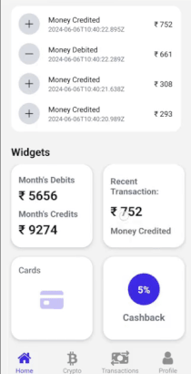

# Fintech

## 📋 <a name="table">Table of Contents</a>

1. 🤖 [Introduction](#introduction)
2. 🖼️ [Screenshots](#screenshots)
3. ⚙️ [Tech Stack](#tech-stack)
4. 🔋 [Features](#features)
5. 🤸 [Quick Start](#quick-start)

## <a name="introduction">🤖 Introduction</a>

Welcome to the **Fintech**. This cutting-edge mobile application, built using React Native and Clerk as a cloud backend, is designed to help you seamlessly manage and track your financial activities. Whether you're dealing with traditional transactions, transfers, or keeping up with the latest crypto trends, this app provides a comprehensive solution to meet all your financial tracking needs. 🚀

```
This is still a work in progress.

Things in Pipeline
- DOwnload transaction statement as pdf file.
- Help/FAQ screen
- Wishlisting/NOtification for the desired currency that user might wnat to track.
- Account settings

Pull requests are always welcome. 
```

## <a name="screenshots">🖼️ Screenshots</a>

<div style="display: flex; flex-direction: 'row';">
 
 
  
 
 
 
 
 
 
 
 
</div>

## <a name="tech-stack">⚙️ Tech Stack</a>

- React Native
- Expo
- Stylesheet
- Clerk
- Shopify Skia
- Zustand
- Async Storage
- Reanimated 3

## <a name="features">🔋 Features</a>

👉 **Onboarding Screen**: Engaging graphical video and clear instructions welcome users to the app.

👉 **Robust Authentication & Authorization System**: Use Clerk for user authentication with OTP.

👉 **Drag-&-Drop**: With Reanimated and Gestures, App Widgets, Enhance your home screen with customizable widgets for quick insights .

👉 **User-Incativity Lock Screen**: Secure your data with biometrics (fingerprint and face ID), passcode entry, and inactivity lock screens.

👉 **Transaction Management**: Easily view and manage all your transactions in one place.

👉 **Nested Navigation**: Bottoms-Tabs & Native-Stack Navigation, Navigate between multiple screens.

👉 **Crypto Trends**: Stay updated with the latest cryptocurrency trends and data.

👉 **User Profile Management**: View account details and activity, Upload and edit your profile picture and user details..

👉 **Responsiveness**: Smooth performance and adaptability across various devices and screen sizes for a consistent user experience.

👉 **Cross-Platform**: Enjoy a consistent experience on both iOS and Android devices.

👉 **Cloud Backend**: Powered by Clerk, ensuring secure and scalable auth.

👉 **Local Async Storage**: Efficient and reliable local storage for your data using react-native-async-storage.

👉 **Custom UI Components**: Enjoy a sleek and intuitive interface with dropdown menus, custom screen headers, and more, all made from scratch using React Native components.

👉 **State Management with Zustand**: Experience smooth and efficient state management for a seamless user experience.

👉 **Graphical Charts Tracking**: Track your desired currency progress through charts with haptic feedbacks.

and many more, including code architecture and reusability

## <a name="quick-start">🤸 Quick Start</a>

Follow these steps to set up the project locally on your machine.

**Prerequisites**

Make sure you have the following installed on your machine:

- [Git](https://git-scm.com/)
- [Node.js](https://nodejs.org/en)
- [npm](https://www.npmjs.com/) (Node Package Manager)

**Cloning the Repository**

```bash
git clone https://github.com/SiddharthSsb11/rn-fintech.git
cd rn-fintech
```
**Installation**

Install the project dependencies using npm:

```bash
npm install
```

**Running the Project**

```bash
npm start
```

**Expo Go**

Download the [Expo Go](https://expo.dev/go) app onto your device, then use it to scan the QR code from Terminal and run.